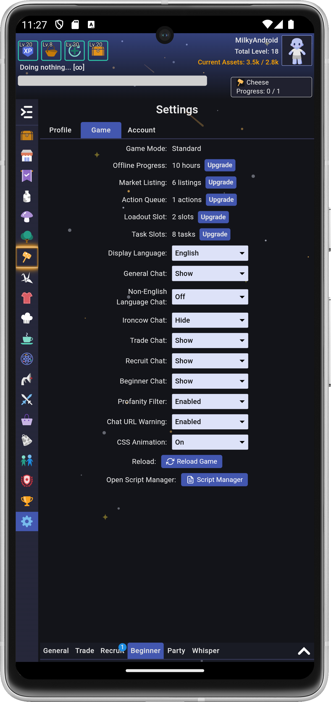
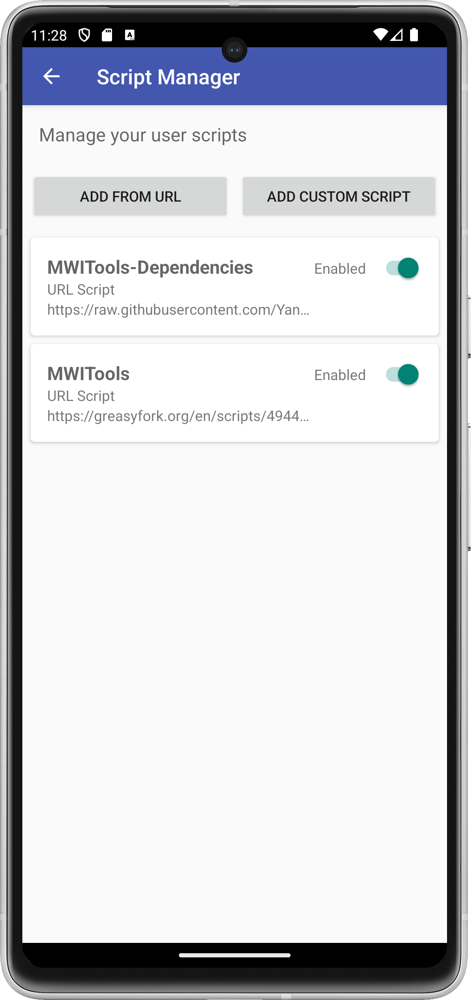
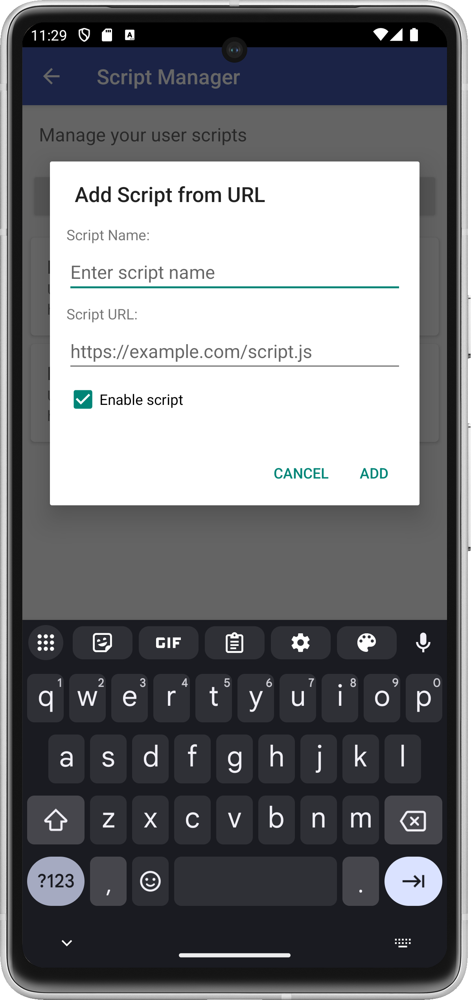
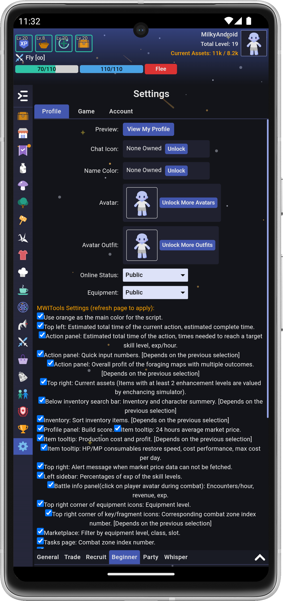
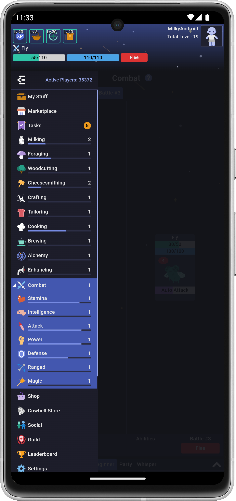
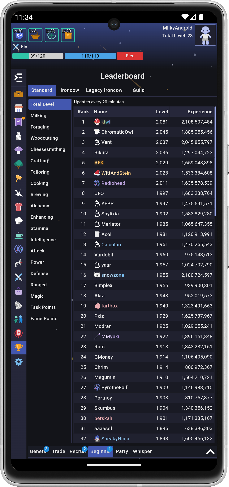
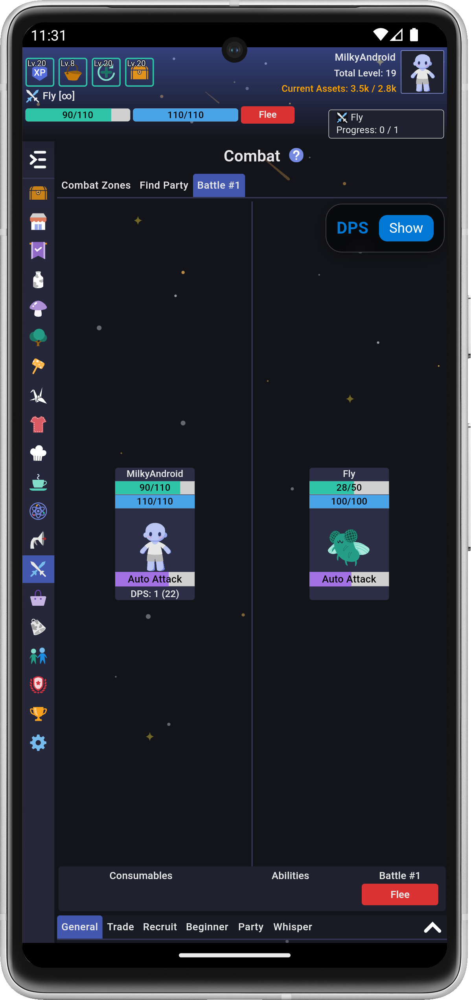
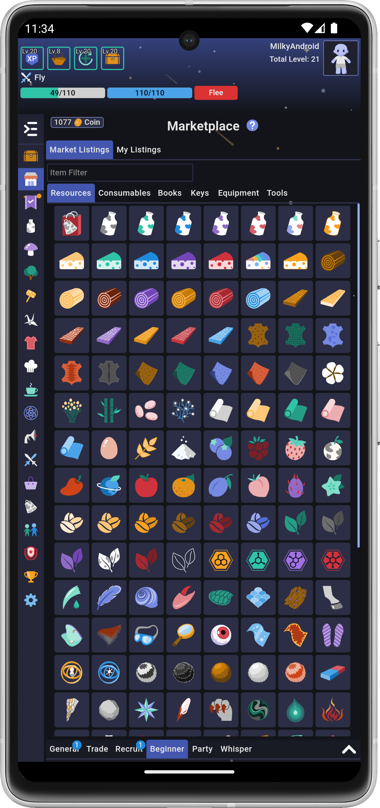
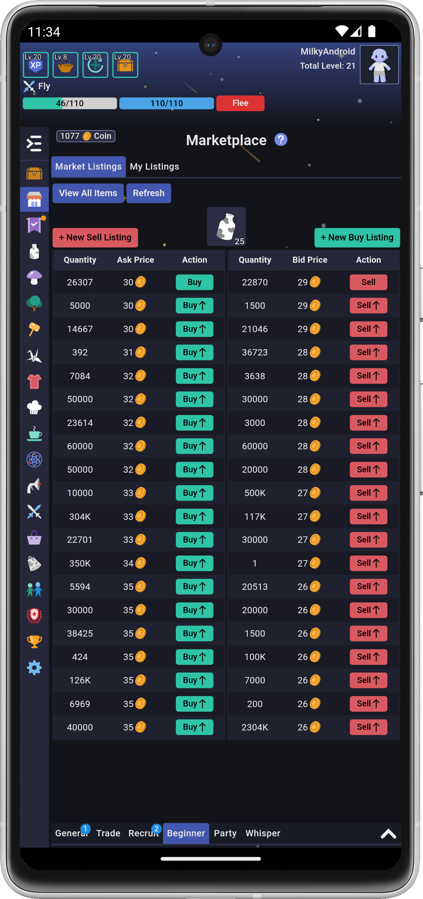

# Unofficial [Milky Way Idle](https://www.milkywayidle.com) for Android!

*This is not developed by or affiliated with Milky Way Idle's original creator.*

  

**This is an unofficial Android client for Milky Way Idle with an inbuilt script manager!**

## Milky Way Idle Features

Step into Milky Way Idle, a multiplayer idle game that combines classic RPG elements with automated progression and an active community. Level up skills, manage resources, craft equipment, and battle monsters - all while progressing effortlessly, even when offline.

* **Automated Progression:** Queue up a sequence of actions with offline progress of 10+ hours (or days!). No manual grinding - plan smart and play at your own pace.
* **Level Up Skills:** Level up 10 non-combat skills and 7 combat skills. Choose how to allocate your time and resources to optimize your growth.
* **Gather And Craft:** Gather resources and craft them into consumables, equipment, and more.
* **AFK Combat:** Battle monsters, bosses, and dungeons with diverse combat styles while fully AFK. Auto-activate consumables and abilities with configurable conditions.
* **Multiplayer:** Trade valuable items, party up for dungeons, socialize in guilds, and climb the leaderboards.
* **Long-Term Depth:** Unlock hundreds of items, hunt rare drops, enhance your equipment. Enjoy content designed to last months or even years.
* **Active Development:** New features and updates arrive every 1-2 months to expand your journey.

## Unofficial Milky Way Idle for Android Features

- **Custom JavaScript Support:** Run custom scripts to enhance your gameplay experience
  - Support for both URL-based and inline JavaScript  
 
- **Script Manager:** Control all of your scripts! Accessed via Settings → Game → Script Manager
  - Enable scripts
  - Disable scripts
  - Delete scripts
  - Install new scripts

- **Pre-installed with useful extensions:** There are a few useful extensions that have been bundled in. They are defaulted to **disabled** and can be enabled through the *Script Manager*
  - [MWITools](https://greasyfork.org/en/scripts/494467-mwitools)
  - [MWITools dependencies](https://raw.githubusercontent.com/YangLeda/Userscripts-For-MilkyWayIdle/refs/heads/main/MWITools%20addon%20for%20Steam%20version.js)

## Installation

Download the latest APK release file from this GitHub repository.

## Support

Any changes to the scripts (e.g. enabling, disabling, adding a new one) will require a game reload or an app restart to take effect.

Whisper me (*McPeyen*) in game or raise an issue here with any problems.

## Known Issues

Some MWI Tools UI elements can get duplicated. Reload the game or restart the app to fix these.

## Screenshots

### Mobile

## Privacy Policy

Unofficial Milky Way Idle for Android is simply a wrapper application for https://www.milkywayidle.com.
This app collects no data from the user.

## License

[MIT License](https://github.com/McPeyen/Unofficial-Milky-Way-Idle-for-Android/blob/main/LICENSE)
